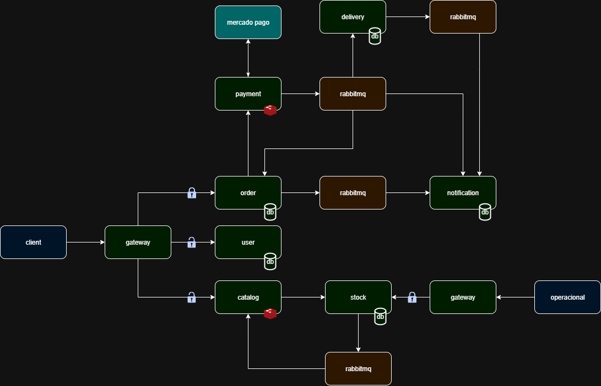

# Coffee Hub - Plataforma de E-commerce de Café com Microsserviços

---

## 📘 Sobre o projeto

O CoffeeHub é uma plataforma de e-commerce especializada em produtos de café, incluindo bebidas, grãos, cafeteiras e acessórios. 
A plataforma permite que clientes explorem o catálogo, realizem pedidos, paguem online e acompanhem o status de suas compras em 
tempo real. 

O sistema é construído com microsserviços independentes, garantindo escalabilidade, resiliência e segurança. 
Cada serviço gerencia funcionalidades específicas, como autenticação, catálogo, pedidos, pagamentos, notificações e logística de 
entrega, comunicando-se via REST e eventos assíncronos. 

Com monitoramento centralizado, autenticação segura via JWT e bancos de 
dados isolados por serviço, o CoffeeHub oferece uma experiência confiável e fluida para os amantes de café.

---

## 🏗️ Arquitetura

---

## Licença
Este projeto está licenciado sob a Licença MIT. Veja o arquivo [LICENSE](LICENSE) para mais detalhes.